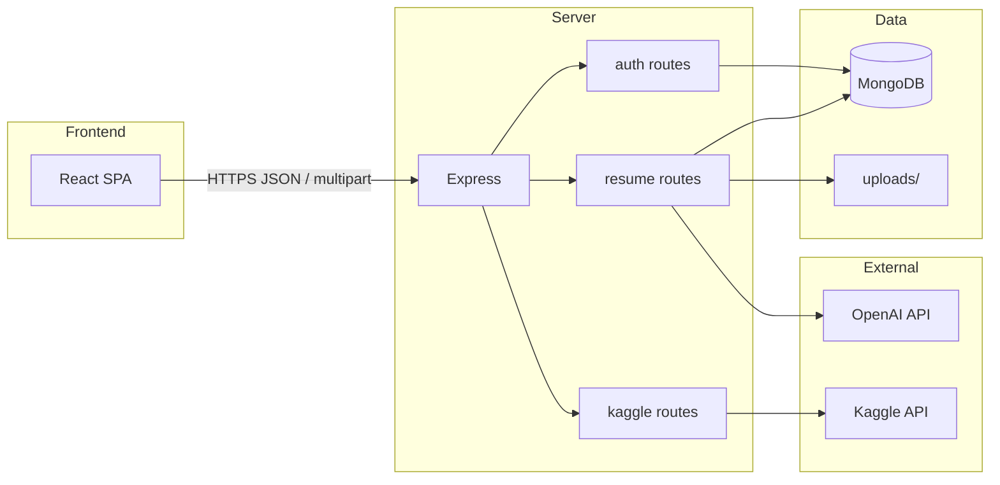

# Architecture (post-delivery)

## Executive summary

UtopiaHire is a monorepo: **Vite + React + TypeScript** SPA talks to an **Express + Mongoose (MongoDB)** API for local email/password auth, resume upload/parsing, and OpenAI-powered resume analysis. Optional Kaggle proxy exists for dataset metadata.

## High-level diagram

## Frontend (`frontend/`)

- **Entry**: `src/main.tsx` → `App.tsx`.
- **Auth**: `contexts/AuthContext.tsx` stores JWT in `localStorage`.
- **API**: `src/api.ts` exports `API_BASE` (`VITE_API_URL` || `VITE_API_BASE`); `src/lib/api.ts` implements fetch wrappers.
- **Main UI**: `AuthForm.tsx` (login/signup), `ResumeUpload.tsx` (upload + trigger process), `FeedbackViewer.tsx` (versions + feedback).

## Backend (`server/`)

- **Entry**: `src/index.ts` — middleware stack, mounts routers, starts HTTP after `connect()`.
- **Config**: `src/config/env.ts` — dotenv, JWT/CORS helpers.
- **DB**: `src/db.ts` — `mongoose.connect(MONGODB_URI | DATABASE_URL)`.
- **Auth**: `src/auth.ts` — `/auth/signup`, `/auth/login`, `/auth/me`.
- **Resumes**: `src/routes/resume.ts` — upload, create, list, versions, feedback, process, accept, tailor, download.
- **Kaggle**: `src/routes/kaggle.ts` — `/kaggle/datasets`.
- **AI**: `src/openai.ts` — `analyzeResume()` via OpenAI chat completions.

## Shared (`shared/`)

- Types/constants package built with `tsc` (**inferred**: lightly used by app; confirm imports per feature).

## Edge (`edge/`)

- Deno-oriented OpenAI/Kaggle scripts (**inferred**: parallel path to Node server; not wired into main Express app).

## Data model (Mongoose)

- **User**: `email` (unique), `name`, `password_hash`, `provider`, `created_at`.
- **Resume**: `user_id`, `title`, `created_at`.
- **ResumeVersion**: `resume_id`, `version_label`, `content_text`, `storage_path`, `created_at`.
- **Feedback**: `resume_version_id`, `author`, `suggestions` (mixed), `created_at`.

## Authentication flow

1. Client `POST /auth/signup` or `/auth/login` → receives JWT.
2. Client sends `Authorization: Bearer <token>` on protected routes.
3. `requireAuth` verifies JWT and sets `req.user` (`id`, `email`).

## Deployment topology (recommended)

- **Browser** → **CDN/static host** (frontend `dist/`) + **API host** (Node process) + **MongoDB** (Atlas or self-hosted).
- Terminate TLS at reverse proxy; set `CORS_ORIGIN`, `JWT_SECRET`, `NODE_ENV=production`, `MONGODB_URI`, `OPENAI_API_KEY`.
