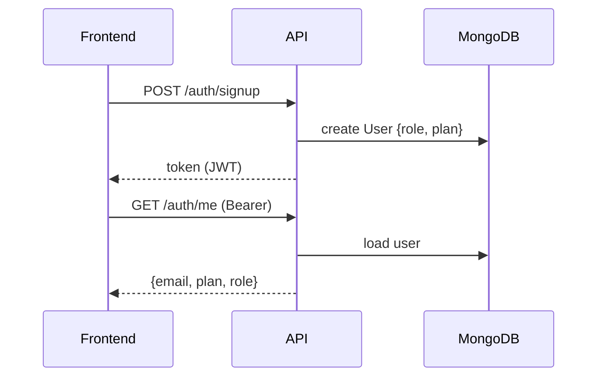

# Architecture

## Overview

- **Frontend**: Vite + React + TypeScript (`frontend/`)
- **Backend**: Node + Express + TypeScript (`server/`)
- **DB**: MongoDB (Mongoose)
- **Shared contracts**: TypeScript types (`shared/`)
- **AI provider**: OpenAI (chat JSON style)

## Key architectural goals

- Enforce plans **server-side** (never trust UI gating)
- Admin-manageable dynamic content/settings
- Auditability for admin actions + billing changes
- Observability for AI calls and failures (request ids)

## Services/modules

- **Auth service**: JWT, password hashing, roles
- **Resume service**: upload/text extraction, versions, feedbacks, downloads
- **CV Pro service**: diagnosis, job match, rewrite-section
- **Billing service** (to implement): subscription records + webhook ingestion
- **Admin service**: RBAC, content/settings CRUD, audit logs
- **Analytics service**: event ingestion + aggregates for admin dashboard

## Mermaid: system diagram

```mermaid
flowchart LR
  U[User Browser] --> FE[Frontend (Vite/React)]
  FE -->|JWT Bearer| API[Express API]
  API --> DB[(MongoDB)]
  API -->|AI calls| OAI[OpenAI]
  A[Admin Browser] --> AFE[Admin UI (same FE)]
  AFE -->|Admin JWT| API
  API -->|webhooks| BILL[Billing Provider]
```

## Mermaid: auth + roles



## Admin architecture (high-level)

- Add `role` to `User` (e.g. `user`, `admin`, `support`, `super_admin`)
- Admin routes under `/admin/*` with strict RBAC middleware
- All admin writes produce `AuditLog` entries

## Dynamic content/settings

- `AdminSetting`: key/value with type + validation rules + env overrides
- `ContentBlock`: typed blocks for pricing, landing sections, banners, help center, FAQ
- Optional publish workflow: draft → published, with audit logs

## Background jobs (future-ready)

For scale and reliability:
- Queue AI processing jobs (BullMQ/Redis) instead of blocking HTTP calls
- Store AI job status and results; expose status in UI

