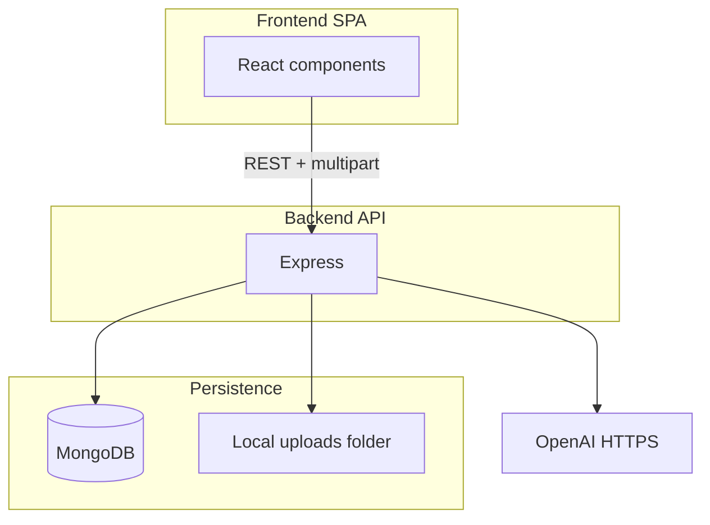

# UtopiaHire — architecture

## Executive summary

UtopiaHire helps users upload a resume (file or pasted text), run AI-assisted analysis via OpenAI, and inspect versioned resume text plus structured feedback stored in MongoDB.

## Product purpose

Improve resumes through AI-generated suggestions and rewritten content, with a simple web UI.

## Main user roles

- **Authenticated user** (email + password). No separate admin/employer roles in codebase.

## Functional scope

- Registration / login / JWT session (client-side storage).
- Resume CRUD-lite: create via upload or JSON `create`; list resumes; version history.
- AI processing on a specific version; optional industry tailoring on latest version.
- Optional Kaggle dataset listing (authenticated proxy).

## High-level architecture

## Frontend architecture

- **Build**: Vite (`frontend/vite.config.ts`).
- **Styling**: Tailwind (`tailwind.config.js`, `index.css`).
- **State**: React local state + `AuthContext` for token.
- **HTTP**: `frontend/src/lib/api.ts` (helpers), `frontend/src/api.ts` (`API_BASE`).

## Backend architecture

- **HTTP**: Express (`server/src/index.ts`).
- **Middleware**: CORS, helmet, JSON parser, rate limits, request logging, `passport.initialize()` (OAuth not mounted).
- **Routers**: `auth`, `resumes`, `kaggle`.

## Database / data model

See `server/src/models/*.ts` — User, Resume, ResumeVersion, Feedback.

## Authentication / authorization

- JWT issued on signup/login; validated by `requireAuth`.
- Resume ownership enforced by comparing `Resume.user_id` to JWT user id (via version → resume join).

## API structure

See `API_MAP.md`.

## State management

- No Redux/Zustand; component-local state and context only.

## Third-party integrations

- OpenAI Chat Completions (`server/src/openai.ts`).
- Kaggle HTTP API (`server/src/routes/kaggle.ts`).
- **Unused in code**: `@supabase/supabase-js` in `frontend/package.json` (**confirmed** by grep).

## File / module organization

See `FOLDER_STRUCTURE.md`.

## Deployment / runtime

- Frontend: static hosting of `frontend/dist`.
- Backend: Node process running `server/dist/index.js` after `npm run build` in `server/`.
- MongoDB required.

## Security considerations

See `AUTH_AND_SECURITY.md` and `delivery-workspace/SECURITY_REVIEW.md`.

## Performance considerations

- OpenAI calls are synchronous in HTTP request — long requests under load (**risk**).
- No caching layer for list endpoints.

## Technical debt / risks

See `TECH_DEBT_AND_RECOMMENDATIONS.md`.

## Future scalability

- Async jobs for OpenAI; read replicas for Mongo; object storage for files; horizontal API instances behind load balancer with sticky sessions **or** stateless uploads to object store.
