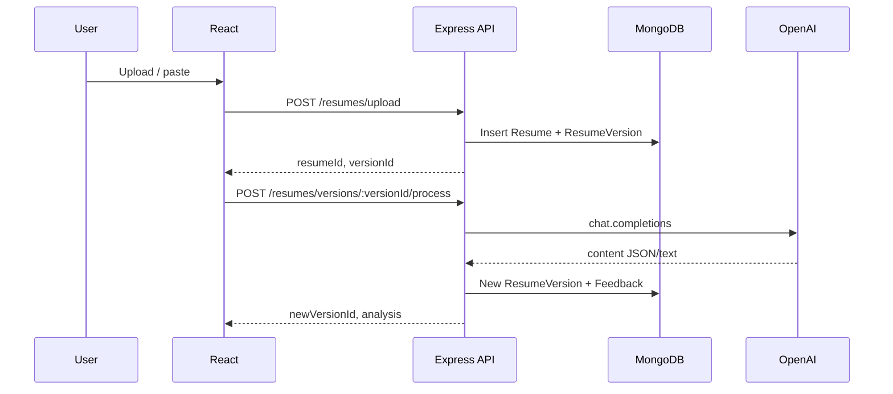

# Data flow

## User input → frontend

1. User completes `AuthForm` → `POST /auth/login|signup` → token stored in `localStorage` via `AuthContext`.
2. User selects file or pastes text in `ResumeUpload` → `FormData` `POST /resumes/upload` **or** synthetic `.txt` file from paste.
3. Client receives `{ resumeId, versionId }` → calls `POST /resumes/versions/:versionId/process` with Bearer token.

## Frontend → backend

- JSON bodies for auth, `create`, `process`, `accept`, `tailor`, feedback POSTs.
- Multipart for `upload` (`file` field).

## Backend → database

- Mongoose creates/reads `User`, `Resume`, `ResumeVersion`, `Feedback`.
- Ownership: `Resume.user_id` must match JWT user for version-scoped operations.

## Async jobs / events

- **None** in current Express app — OpenAI is inline with HTTP (**scalability note**).

## External APIs

- **OpenAI**: `https://api.openai.com/v1/chat/completions` from `server/src/openai.ts`.
- **Kaggle**: `https://www.kaggle.com/api/v1/datasets/list?...` from `server/src/routes/kaggle.ts`.

## Edge scripts (`edge/`)

- **Inferred**: intended for Deno deploy or CLI; environment variables passed separately; not part of default `npm run dev` flow.
